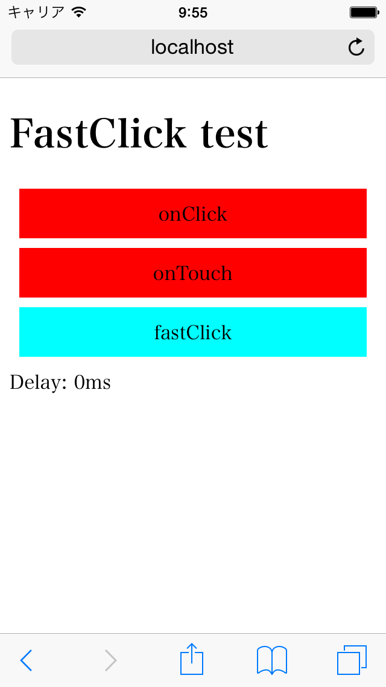

FastClickを使った体感応答時間の短縮テスト
====================================

先日ガワネイティブのアプリを作ろうと思ってWebViewを組み込んだテストアプリを作ってみた
（[iOS](https://github.com/tyfkda/GawaNativeIos),
[Android](https://github.com/tyfkda/GawaNativeAndroid)）。
その際クリックに対する反応が悪いのが気になった。

スマホのブラウザではダブルタップによるズームを考慮するためにタップを離してから300msの
遅れを待ってから実際にクリックされたという判定を行っているらしい。その性で応答が悪く
感じられてしまう。

そこで[FastClick](https://github.com/ftlabs/fastclick)というJavaScriptのライブラリを
使って、タップの応答がどう変わるかテストしてみる。


結論
====

ダブルタップが必要ないページにFastClickを組み込むのは有効。


動作デモ
========

[デモ](http://tyfkda.github.io/fastclick-test/),
[コード](https://github.com/tyfkda/fastclick-test)



１番目が onclick イベントを使ったアイテム、
２番目が ontouchend イベントを使ったアイテム、
３番目が FastClick を使ったアイテムとなっている。

onclickイベントを使ったものはタップしてからちょっと遅れて onclick ハンドラが呼び出され、
背景色が反転する。

ontouchendイベントを使ったものはタップを離してすぐに反応する。しかしエリア内でタッチして
そのまま動かしてから離してもタッチエンドイベントが呼び出されるため、スワイプによってスクロール
させる動作の場合にも色が反転してしまう。

FastClickを使った場合にはすぐに反応し、またスワイプした場合には反応しないようになっている。
しかし長押しした場合にはonclickイベントが呼び出されてしまっている。

FastClickの使い方
================

FastClickを有効にするには、スマホ対応のページであるということを指定してある必要がある。
実際には、ビューポートでページ幅をデバイス幅に指定してあると有効になる。

```html
  <meta name="viewport" content="width=device-width">
```

FastClickを適用するには、適用する要素自体じゃなくて、それらを含む要素を与える必要がある。

```html
  <div id="fastclick_area">
    <!-- この内部のノードにFastClickが適用されるが、fastclick_area自体は対象外 -->
    <div onclick="...">
      ...
    </div>
  </div>
```

```js
window.addEventListener('load', function() {
  FastClick.attach(document.getElementById('fastclick_area'));
});
```

ページ全体に適用するために`document.body`を渡す分にはよいが、そうでない場合には注意。


FastClickの仕組み
================

基本的には自分でontouchイベントを扱ってる場合と原理的には同じで、
ontouchイベントを適切に処理して必要な時にonclickイベントを呼び出している。

機種やバージョンによって様々な挙動の差があるのを吸収してくれている。


AndroidのChromeでは対策が取られている
==================================

最近のAndroidのChromeでは、htmlのビューポート指定でデバイス幅以下の場合にはダブルタップに
よるズームは効かなくなっていて、300ms待たないようになっているらしい。
（[300ms tap delay, gone away](http://updates.html5rocks.com/2013/12/300ms-tap-delay-gone-away#disqus_thread)）
  * ピンチによるズームはできる
  * iOS, Safariだとダブルタップにスクロールが割り当てられているので、できないんじゃないか
    という話

FastClickはそのへんも対応していて、必要ない場合にはontouchリスナーを設定しないように
なっている。
（試したところonclickからontouchendまでは10~50msくらいの遅れが生じているようだが…）
